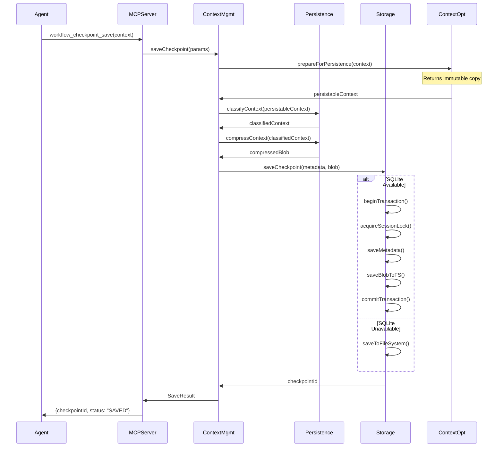
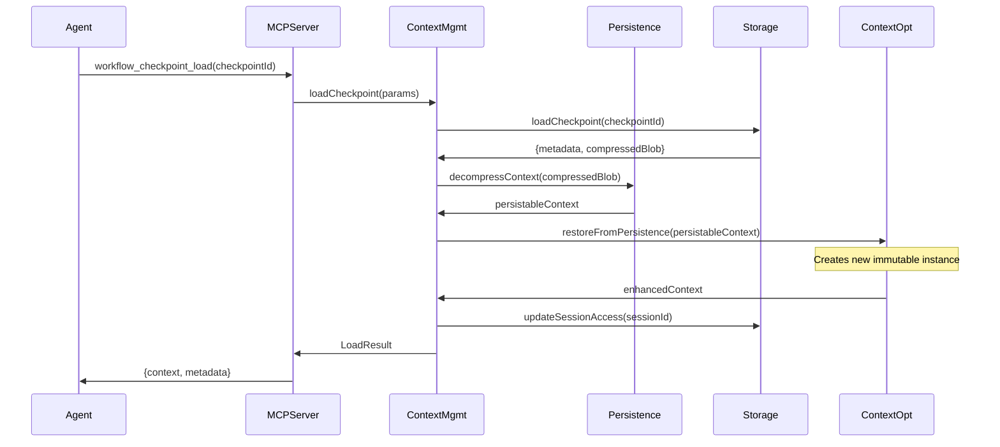
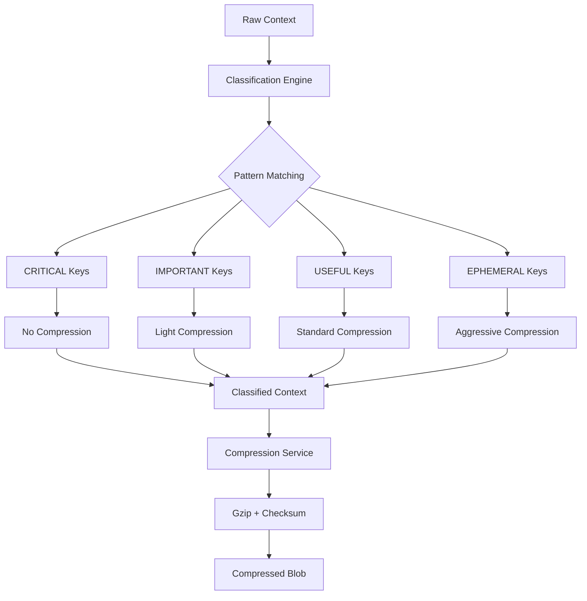

# Native Context Management - Architectural Design

**Version:** 1.0  
**Date:** 2024-01-09  
**Based on:** spec.md v1.0, Phase 2 clarifications, Large complexity assessment  

---

## Version History
| Version | Date | Changes |
|---------|------|---------|
| 1.0 | 2024-01-09 | Initial design based on spec.md v1.0, Phase 2 clarifications |

---

## 1. High-Level Approach

### Design Philosophy
Build upon WorkRail's existing clean architecture patterns while introducing a parallel context management layer that maintains the MCP's stateless design. The solution follows the **Decorator Pattern** for storage, **Dependency Injection** for services, and **Interface Segregation** for APIs.

#### SOLID Compliance
- **S (Single Responsibility)**: Each service has a single responsibility (ContextManagementService=facade, ContextPersistenceService=core logic)
- **O (Open-Closed)**: Extend via decorators without modifying core components
- **L (Liskov Substitution)**: All storage implementations interchangeable via IContextStorage
- **I (Interface Segregation)**: Minimal, focused interfaces (separate classification, compression, storage)
- **D (Dependency Inversion)**: High-level modules depend on abstractions, not concretions

### Core Strategy
```
┌─────────────────┐     ┌──────────────────┐     ┌─────────────────┐
│   MCP Client    │────▶│   MCP Server     │────▶│  Context Layer  │
│                 │     │   (Stateless)    │     │   (Stateful)    │
└─────────────────┘     └──────────────────┘     └─────────────────┘
                               │                           │
                        ┌──────▼────────┐          ┌──────▼────────┐
                        │ Workflow      │          │ Context       │
                        │ Services      │──────────│ Services      │
                        │ (Existing)    │          │ (New Layer)   │
                        └───────────────┘          └───────────────┘
```

### Integration Approach
- **Parallel Services**: ContextPersistenceService works alongside existing ContextOptimizer
- **Shared Infrastructure**: Reuse DI container, error handling, and testing patterns
- **Optional Dependencies**: SQLite and encryption gracefully degrade if unavailable
- **Zero-Config**: Works out-of-the-box with platform-appropriate defaults

### 1.5 Non-Functional Requirements
- **Max open DB connections**: 10 concurrent connections
- **Memory usage**: <50MB for context management layer
- **Startup time**: <500ms for service initialization
- **Database query timeout**: 5 seconds with retry
- **File I/O timeout**: 10 seconds for large blobs
- **Concurrent session limit**: 100 active sessions

---

### 1.6 Core Interfaces
```typescript
// Central interface definitions referenced throughout components
export interface IContextStorage {
  saveCheckpoint(metadata: CheckpointMetadata, blob: CompressedBlob): Promise<string>;
  loadCheckpoint(checkpointId: string): Promise<{metadata: CheckpointMetadata, blob: CompressedBlob}>;
  listCheckpoints(sessionId: string, limit?: number, offset?: number): Promise<CheckpointMetadata[]>;
  // ... (see Section 4.1 for complete definition)
}

export interface IContextManagementService {
  saveCheckpoint(params: SaveCheckpointParams): Promise<SaveCheckpointResult>;
  loadCheckpoint(params: LoadCheckpointParams): Promise<LoadCheckpointResult>;
  listCheckpoints(params: ListCheckpointsParams): Promise<CheckpointMetadata[]>;
  // ... (see Section 4.1 for complete definition)
}

export interface IContextPersistenceService {
  classifyContext(context: object): ClassifiedContext;
  compressContext(classified: ClassifiedContext): CompressedContext;
  decompressContext(compressed: CompressedContext): object;
  // ... (see Section 2.1 for complete definition)
}
```

---

## 2. Component Breakdown

### 2.1 New Services Layer

#### Common Service Pattern
```typescript
// Standard constructor pattern for all context services
constructor(
  private readonly dependency1: IDependency1,
  private readonly dependency2: IDependency2,
  private readonly config?: ServiceConfig
) {}
// Applied to: ContextManagementService, ContextPersistenceService, ClassificationEngine, CompressionService
```

#### ContextManagementService (Facade)
```typescript
// Location: src/application/services/context-management-service.ts
export interface IContextManagementService {
  saveCheckpoint(params: SaveCheckpointParams): Promise<SaveCheckpointResult>;
  loadCheckpoint(params: LoadCheckpointParams): Promise<LoadCheckpointResult>;
  listCheckpoints(params: ListCheckpointsParams): Promise<CheckpointMetadata[]>;
  markCritical(params: MarkCriticalParams): Promise<MarkCriticalResult>;
}

export class ContextManagementService implements IContextManagementService {
  constructor(
    private readonly storage: IContextStorage,
    private readonly persistenceService: IContextPersistenceService,
    private readonly sessionManager: ISessionManager
  ) {}
}
```

#### ContextPersistenceService (Core Logic)
```typescript
// Location: src/application/services/context-persistence-service.ts
export interface IContextPersistenceService {
  classifyContext(context: object): ClassifiedContext;
  compressContext(classified: ClassifiedContext): CompressedContext;
  decompressContext(compressed: CompressedContext): object;
  generateSessionId(workflowId: string, context: object): string;
}

export class ContextPersistenceService implements IContextPersistenceService {
  constructor(
    private readonly classificationEngine: IClassificationEngine,
    private readonly compressionService: ICompressionService
  ) {}
}
```

#### ClassificationEngine
```typescript
// Location: src/application/services/classification-engine.ts
export interface IClassificationEngine {
  classify(context: object, rules?: ClassificationRules): ClassifiedContext;
  loadRules(configPath?: string): ClassificationRules;
}

export class ClassificationEngine implements IClassificationEngine {
  private defaultRules: ClassificationRules;
  private overrides: Map<string, ContextLayer> = new Map();
}
```

#### CompressionService
```typescript
// Location: src/application/services/compression-service.ts
export interface ICompressionService {
  compress(data: object, strategy?: CompressionStrategy): CompressedBlob;
  decompress(blob: CompressedBlob): object;
  getCompressionRatio(original: object, compressed: CompressedBlob): number;
}

export class CompressionService implements ICompressionService {
  constructor(private readonly config: CompressionConfig) {}
}
```

### 2.2 Storage Layer (Following Existing Patterns)

#### IContextStorage (Main Interface)
```typescript
// Location: src/infrastructure/storage/context-storage.ts
export interface IContextStorage {
  saveCheckpoint(metadata: CheckpointMetadata, blob: CompressedBlob): Promise<string>;
  loadCheckpoint(checkpointId: string): Promise<{metadata: CheckpointMetadata, blob: CompressedBlob}>;
  listCheckpoints(sessionId: string, limit?: number, offset?: number): Promise<CheckpointMetadata[]>;
  deleteCheckpoint(checkpointId: string): Promise<void>;
  getSessionInfo(sessionId: string): Promise<SessionInfo | null>;
  updateSessionAccess(sessionId: string): Promise<void>;
}
```

#### HybridContextStorage (Decorator Composition)
```typescript
// Location: src/infrastructure/storage/hybrid-context-storage.ts
export class HybridContextStorage implements IContextStorage {
  constructor(
    private readonly metadataStorage: IMetadataStorage,
    private readonly blobStorage: IBlobStorage,
    private readonly config: StorageConfig
  ) {}
}

// Composition similar to existing workflow storage:
// HybridContextStorage(
//   SqliteMetadataStorage | FileSystemMetadataStorage,
//   FileSystemBlobStorage
// )
```

#### SqliteMetadataStorage
```typescript
// Location: src/infrastructure/storage/sqlite-metadata-storage.ts
export class SqliteMetadataStorage implements IMetadataStorage {
  constructor(private readonly db: Database, private readonly migrator: ISqliteMigrator) {}
  
  private createSessionIfNotExists(sessionId: string): Promise<void>;
  private acquireSessionLock(sessionId: string): Promise<void>;
  private releaseSessionLock(sessionId: string): Promise<void>;
}
```

#### FileSystemBlobStorage
```typescript
// Location: src/infrastructure/storage/filesystem-blob-storage.ts
export class FileSystemBlobStorage implements IBlobStorage {
  constructor(
    private readonly basePath: string,
    private readonly encryptionService?: IEncryptionService
  ) {}
  
  private writeAtomically(path: string, data: Buffer): Promise<void>;
  private validateChecksum(path: string, expectedHash: string): Promise<boolean>;
}
```

### 2.3 Modified Existing Components

#### ContextOptimizer (Enhanced)
```typescript
// Location: src/application/services/context-optimizer.ts (modified)
export class ContextOptimizer {
  // ... existing methods ...
  
  // NEW: Prepare context for persistence
  static prepareForPersistence(context: EnhancedContext): PersistableContext {
    // Remove runtime-specific metadata, freeze for immutability
    const persistable = { ...context };
    delete persistable._currentLoop; // Runtime-only data
    return Object.freeze(persistable) as PersistableContext; // Returns immutable copy
  }
  
  // NEW: Rehydrate context from storage
  static restoreFromPersistence(persistable: PersistableContext): EnhancedContext {
    // Restore to runtime format, add back runtime metadata
    return ContextOptimizer.createEnhancedContext(persistable, {
      _contextSize: JSON.stringify(persistable).length
    }); // Creates new immutable instance
  }
}
```

#### Container (Extended)
```typescript
// Location: src/container.ts (modified)
export interface AppContainer {
  // ... existing services ...
  contextStorage: IContextStorage;
  contextManagementService: IContextManagementService;
  contextPersistenceService: IContextPersistenceService;
  classificationEngine: IClassificationEngine;
  compressionService: ICompressionService;
  sessionManager: ISessionManager;
  encryptionService?: IEncryptionService;
}

export function createAppContainer(overrides: Partial<AppContainer> = {}): AppContainer {
  // ... existing setup ...
  
  // Context management services
  const contextStorage = overrides.contextStorage ?? createDefaultContextStorage();
  const classificationEngine = overrides.classificationEngine ?? new ClassificationEngine();
  const compressionService = overrides.compressionService ?? new CompressionService();
  const contextPersistenceService = overrides.contextPersistenceService ?? 
    new ContextPersistenceService(classificationEngine, compressionService);
  const sessionManager = overrides.sessionManager ?? new SessionManager();
  const contextManagementService = overrides.contextManagementService ??
    new ContextManagementService(contextStorage, contextPersistenceService, sessionManager);
  
  return {
    // ... existing services ...
    contextStorage,
    contextManagementService,
    contextPersistenceService,
    classificationEngine,
    compressionService,
    sessionManager
  };
}
```

---

## 3. Data Models

### 3.1 Database Schema (SQLite)

Based on existing migration pattern in `001_initial_schema.sql`:

```sql
-- Sessions table
CREATE TABLE sessions (
    id TEXT PRIMARY KEY,
    created_at DATETIME NOT NULL DEFAULT CURRENT_TIMESTAMP,
    last_accessed_at DATETIME NOT NULL DEFAULT CURRENT_TIMESTAMP,
    workflow_id TEXT,
    tags TEXT, -- JSON array
    total_size_bytes INTEGER NOT NULL DEFAULT 0,
    CONSTRAINT check_total_size CHECK (total_size_bytes >= 0)
);

-- Checkpoint metadata table
CREATE TABLE checkpoint_metadata (
    id TEXT PRIMARY KEY,
    session_id TEXT NOT NULL,
    name TEXT,
    agent_id TEXT,
    created_at DATETIME NOT NULL DEFAULT CURRENT_TIMESTAMP,
    tags TEXT, -- JSON array
    context_size_bytes INTEGER NOT NULL,
    context_hash TEXT NOT NULL,
    blob_path TEXT NOT NULL,
    classification_summary TEXT, -- JSON object
    status TEXT NOT NULL DEFAULT 'active' CHECK (status IN ('active', 'archived', 'corrupt')),
    FOREIGN KEY (session_id) REFERENCES sessions(id) ON DELETE CASCADE,
    CONSTRAINT check_context_size CHECK (context_size_bytes >= 0)
);

-- Session locks for concurrency
CREATE TABLE session_locks (
    session_id TEXT PRIMARY KEY,
    locked_at DATETIME NOT NULL DEFAULT CURRENT_TIMESTAMP,
    expires_at DATETIME NOT NULL,
    FOREIGN KEY (session_id) REFERENCES sessions(id) ON DELETE CASCADE
);

-- Indexes for performance
CREATE INDEX idx_sessions_last_accessed ON sessions(last_accessed_at);
CREATE INDEX idx_checkpoints_session_created ON checkpoint_metadata(session_id, created_at DESC);
CREATE INDEX idx_checkpoints_hash ON checkpoint_metadata(context_hash);
```

### 3.2 TypeScript Type Definitions

```typescript
// Location: src/types/context-types.ts (new file)

export enum ContextLayer {
  CRITICAL = 'CRITICAL',
  IMPORTANT = 'IMPORTANT', 
  USEFUL = 'USEFUL',
  EPHEMERAL = 'EPHEMERAL'
}

export interface ClassifiedContext {
  [ContextLayer.CRITICAL]: Record<string, any>;
  [ContextLayer.IMPORTANT]: Record<string, any>;
  [ContextLayer.USEFUL]: Record<string, any>;
  [ContextLayer.EPHEMERAL]: Record<string, any>;
}

export interface SessionInfo {
  id: string;
  createdAt: string;
  lastAccessedAt: string;
  workflowId?: string;
  tags?: string[];
  totalSizeBytes: number;
}

export interface CheckpointMetadata {
  id: string;
  sessionId: string;
  name?: string;
  agentId?: string;
  createdAt: string;
  tags?: string[];
  contextSizeBytes: number;
  contextHash: string;
  blobPath: string;
  classificationSummary?: ClassificationSummary;
  status: 'active' | 'archived' | 'corrupt';
}

export interface CompressedBlob {
  data: Buffer;
  compressionType: 'gzip' | 'none';
  originalSize: number;
  compressedSize: number;
  checksum: string;
}

export interface ClassificationRules {
  patterns: {
    [layer in ContextLayer]: Array<{
      type: 'key_regex' | 'content_heuristic';
      pattern: string | RegExp;
      priority: number;
    }>;
  };
  budgets: {
    [layer in ContextLayer]: number; // Percentage of total budget
  };
}
```

### 3.3 Configuration Models

```typescript
// Location: src/types/context-config.ts (new file)

export interface ContextConfig {
  storage: {
    basePath?: string; // Default: platform-specific ~/.workrail/
    enableSqlite: boolean; // Default: true with fallback
    maxCheckpoints: number; // Default: 100 per session
    maxTotalSize: number; // Default: 1GB
    cleanupInterval: number; // Default: 30 days
  };
  compression: {
    enabled: boolean; // Default: true
    level: 'basic' | 'standard' | 'aggressive'; // Default: standard
    minSizeForCompression: number; // Default: 1KB
  };
  encryption: {
    enabled: boolean; // Default: false
    provider: 'os_keychain' | 'none'; // Default: os_keychain if available
  };
  classification: {
    rulesPath?: string; // Default: built-in rules
    enableHeuristics: boolean; // Default: true
  };
}
```

---

## 4. API Contracts

### 4.1 MCP Tools (Following Existing Patterns)

Based on existing tool definitions in `mcp-server.ts:182-330`:

```typescript
// Location: src/mcp-server.ts (additions)

const WORKFLOW_CHECKPOINT_SAVE_TOOL: Tool = {
  name: "workflow_checkpoint_save",
  description: `Saves the current workflow state and context to persistent storage. Returns a unique checkpoint ID for future resumption. This operation is atomic and will be skipped if the context is identical to the most recent checkpoint.`,
  inputSchema: {
    type: "object",
    properties: {
      sessionId: {
        type: "string",
        description: "A unique identifier for the current workflow session. If not provided, will be auto-derived from workflow context."
      },
      context: {
        type: "object", 
        description: "The current workflow context object to be saved."
      },
      metadata: {
        type: "object",
        description: "Optional user-defined metadata to attach to the checkpoint.",
        properties: {
          name: { type: "string" },
          tags: { type: "array", items: { type: "string" } }
        }
      },
      force: {
        type: "boolean",
        description: "If true, saves the checkpoint even if the context has not changed since the last save.",
        default: false
      }
    },
    required: ["context"],
    additionalProperties: false
  }
};

const WORKFLOW_CHECKPOINT_LOAD_TOOL: Tool = {
  name: "workflow_checkpoint_load",
  description: `Loads a workflow's state and context from persistent storage. This will replace the active context for the current session. You can load by a specific checkpoint ID or get the latest from a session.`,
  inputSchema: {
    type: "object",
    properties: {
      checkpointId: {
        type: "string",
        description: "The specific checkpoint ID to load. Mutually exclusive with sessionId."
      },
      sessionId: {
        type: "string", 
        description: "The session ID from which to load the latest checkpoint. Used if checkpointId is not provided."
      }
    },
    oneOf: [
      { required: ["checkpointId"] },
      { required: ["sessionId"] }
    ],
    additionalProperties: false
  }
};

const WORKFLOW_CHECKPOINT_LIST_TOOL: Tool = {
  name: "workflow_checkpoint_list",
  description: `Lists metadata for available checkpoints, ordered from most recent to oldest. Useful for finding a checkpoint to resume from.`,
  inputSchema: {
    type: "object",
    properties: {
      sessionId: {
        type: "string",
        description: "The session ID to retrieve checkpoints for."
      },
      limit: {
        type: "number",
        description: "The maximum number of checkpoints to return.",
        default: 20,
        minimum: 1,
        maximum: 100
      },
      offset: {
        type: "number", 
        description: "The number of checkpoints to skip, for pagination.",
        default: 0,
        minimum: 0
      }
    },
    required: ["sessionId"],
    additionalProperties: false
  }
};

const WORKFLOW_MARK_CRITICAL_TOOL: Tool = {
  name: "workflow_mark_critical",
  description: `Provides an agent override to mark a specific key-value pair in the context as CRITICAL. This prevents it from being compressed or dropped under any circumstances. Use this for essential information like user goals or final answers.`,
  inputSchema: {
    type: "object",
    properties: {
      sessionId: {
        type: "string",
        description: "The session ID for the context being modified."
      },
      contextKey: {
        type: "string",
        description: "The top-level key in the context object to mark as critical."
      }
    },
    required: ["sessionId", "contextKey"],
    additionalProperties: false
  }
};
```

### 4.2 Error Responses (Following Existing Patterns)

```typescript
// Location: src/core/error-handler.ts (additions)

export class CheckpointNotFoundError extends MCPError {
  constructor(checkpointId: string) {
    super(
      MCPErrorCodes.CHECKPOINT_NOT_FOUND, // = 404
      `Checkpoint with id '${checkpointId}' not found`,
      { checkpointId }
    );
  }
}

export class SessionNotFoundError extends MCPError {
  constructor(sessionId: string) {
    super(
      MCPErrorCodes.SESSION_NOT_FOUND, // = 404
      `Session with id '${sessionId}' not found`,
      { sessionId }
    );
  }
}

export class StorageQuotaExceededError extends MCPError {
  constructor(currentSize: number, maxSize: number) {
    super(
      MCPErrorCodes.STORAGE_QUOTA_EXCEEDED, // = 413
      `Storage quota exceeded: ${currentSize} bytes > ${maxSize} bytes`,
      { currentSize, maxSize }
    );
  }
}

export class StorageUnavailableError extends MCPError {
  constructor(reason: string) {
    super(
      MCPErrorCodes.STORAGE_UNAVAILABLE, // = 503
      `Storage layer unavailable: ${reason}`,
      { reason }
    );
  }
}
```

---

## 5. Key Interactions

### 5.1 Save Checkpoint Flow

**Figure 1: Save Checkpoint Sequence Diagram**



### 5.2 Load Checkpoint Flow

**Figure 2: Load Checkpoint Sequence Diagram**



### 5.3 Classification & Compression Pipeline

**Figure 3: Context Classification and Compression Flow**



### 5.4 Immutability Best Practices
All context handoffs use immutable copies to ensure thread-safety:
- **prepareForPersistence**: Uses Object.freeze() to create immutable snapshot
- **restoreFromPersistence**: Creates new enhanced context instance
- **Classification**: Returns new classified structure without mutating original
- **Compression**: Operates on immutable data, returns new compressed blob

---

## 6. Integration Points

### 6.1 Dependency Injection Integration

**Clarification Decision Referenced**: Separate ContextPersistenceService alongside ContextOptimizer (Phase 2, Question 1)

```typescript
// Following existing container pattern from src/container.ts
export function createAppContainer(overrides: Partial<AppContainer> = {}): AppContainer {
  // Context management factory
  const contextStorage = overrides.contextStorage ?? createDefaultContextStorage();
  
  // Services follow same injection pattern as existing workflow services
  const contextManagementService = overrides.contextManagementService ??
    new ContextManagementService(contextStorage, contextPersistenceService, sessionManager);
    
  return {
    storage, validationEngine, workflowService, server, // existing
    contextStorage, contextManagementService, // new context services
  };
}
```

### 6.2 MCP Server Integration

**Clarification Decision Referenced**: Follow existing MCP tool patterns (Phase 2, architectural fit)

```typescript
// Following existing pattern from mcp-server.ts:348-410
server.setRequestHandler(CallToolRequestSchema, async (request): Promise<CallToolResult> => {
  const { name, arguments: args } = request.params;

  switch (name) {
    // ... existing tool cases ...
    
    case "workflow_checkpoint_save":
      return await workflowServer.saveCheckpoint(args);
      
    case "workflow_checkpoint_load":
      return await workflowServer.loadCheckpoint(args);
      
    case "workflow_checkpoint_list":
      return await workflowServer.listCheckpoints(args);
      
    case "workflow_mark_critical":
      return await workflowServer.markCritical(args);
  }
});
```

### 6.3 Storage Layer Integration

**Clarification Decision Referenced**: Fixed paths with env overrides, optional SQLite (see Phase 2, Questions 2&4 in Section 7)

```typescript
// Following existing storage pattern from src/infrastructure/storage/storage.ts
export function createDefaultContextStorage(): IContextStorage {
  const basePath = getContextStoragePath(); // Uses WORKRAIL_DATA_DIR or platform default
  
  try {
    // Try SQLite first
    const sqliteStorage = new SqliteMetadataStorage(basePath);
    const blobStorage = new FileSystemBlobStorage(basePath);
    return new HybridContextStorage(sqliteStorage, blobStorage);
  } catch (error) {
    // Graceful fallback to filesystem-only
    console.warn('SQLite unavailable, falling back to filesystem storage:', error.message);
    const fileSystemStorage = new FileSystemMetadataStorage(basePath);
    const blobStorage = new FileSystemBlobStorage(basePath);
    return new HybridContextStorage(fileSystemStorage, blobStorage);
  }
}
```

### 6.4 ContextOptimizer Integration

**Clarification Decision Referenced**: Handoff protocol with immutability (Phase 2, Question 1)

```typescript
// Enhanced ContextOptimizer maintains immutability during handoffs
export class ContextOptimizer {
  static prepareForPersistence(context: EnhancedContext): PersistableContext {
    // Create immutable copy, remove runtime-only data
    const persistable = Object.freeze({ ...context });
    delete persistable._currentLoop; // Runtime metadata not persisted
    return persistable;
  }
  
  static restoreFromPersistence(persistable: PersistableContext): EnhancedContext {
    // Rehydrate with runtime metadata
    return ContextOptimizer.createEnhancedContext(persistable, {
      _contextSize: JSON.stringify(persistable).length,
      // Other runtime metadata restored as needed
    });
  }
}
```

---

## 7. Clarification Decisions Impact

### 7.1 Architecture Decisions

| **Clarification** | **Design Impact** | **Implementation** |
|------------------|-------------------|-------------------|
| **Separate ContextPersistenceService** | Maintains single responsibility, doesn't bloat ContextOptimizer | Clean handoff protocol with prepare/restore methods |
| **Fixed storage paths with overrides** | Consistent zero-config experience across platforms | `getContextStoragePath()` with env var support |
| **Hybrid session correlation** | Deterministic sessionId generation with fallbacks | `hash(workflowId + initialContextHash)` primary strategy |
| **Optional SQLite with fallback** | Graceful degradation for compatibility | Try-catch wrapper with filesystem fallback |
| **Performance priority over features** | Optimization goals allow feature deferral | Benchmarking hooks (see Section 8.3), configurable compression levels |
| **In-memory SQLite for unit tests** | Fast, isolated test execution | Test-specific storage factory functions |

### 7.2 Storage Strategy Implementation

**Clarification Decision Referenced**: Storage location strategy (Phase 2, Question 2)

```typescript
function getContextStoragePath(): string {
  // Environment override first
  if (process.env.WORKRAIL_DATA_DIR) {
    return path.join(process.env.WORKRAIL_DATA_DIR, 'context');
  }
  
  // Platform-specific defaults
  const os = require('os');
  switch (process.platform) {
    case 'darwin':
      return path.join(os.homedir(), 'Library', 'Application Support', 'workrail', 'context');
    case 'win32':
      return path.join(process.env.APPDATA || os.homedir(), 'workrail', 'context');
    default: // Linux and others
      return path.join(os.homedir(), '.local', 'share', 'workrail', 'context');
  }
}
```

---

## 8. Complexity Considerations

### 8.1 Large Complexity Factors Addressed

**Re-triage Confirmation**: Large complexity maintained due to multi-layered integration and new dependencies

| **Complexity Factor** | **Architectural Mitigation** |
|-----------------------|------------------------------|
| **New Dependencies (SQLite, encryption)** | Optional dependencies with graceful fallbacks |
| **Cross-Platform Compatibility** | Platform-specific path handling, build fallbacks |
| **Performance SLAs** | Optimization goals, configurable compression, benchmarking |
| **Data Integrity Requirements** | Atomic writes, checksums, transaction support |
| **Multi-Agent Concurrency** | Session locking, pessimistic writes, optimistic reads |
| **Security Considerations** | Input sanitization, file permissions, optional encryption |

### 8.2 Risk Mitigation Through Design

**Integration with existing patterns reduces implementation risk**:
- **Decorator Pattern**: Follows established storage composition model
- **DI Container**: Leverages existing service injection patterns  
- **Error Handling**: Extends proven MCPError architecture
- **Testing Strategy**: Builds on established mock/integration patterns

### 8.3 Performance Optimization Strategy

**Clarification Decision Referenced**: Performance targets as optimization goals (Phase 2, Question 6)

```typescript
// Performance monitoring and feature deferral hooks
export class PerformanceMonitor {
  static async measureOperation<T>(
    operation: () => Promise<T>,
    targetMs: number,
    operationName: string
  ): Promise<T> {
    const start = Date.now();
    const result = await operation();
    const duration = Date.now() - start;
    
    if (duration > targetMs) {
      console.warn(`${operationName} exceeded target: ${duration}ms > ${targetMs}ms`);
      // Could trigger feature deferral or optimization strategies
    }
    
    return result;
  }
}
```

---

## Implementation Readiness

This architectural design provides:

✅ **Clear Component Boundaries**: Well-defined interfaces and responsibilities  
✅ **Existing Pattern Alignment**: Follows established DI, storage, and API patterns  
✅ **Integration Roadmap**: Specific points for connecting with existing systems  
✅ **Complexity Management**: Addresses all Large complexity factors with mitigation strategies  
✅ **Clarification Integration**: Incorporates all Phase 2 decisions into concrete design  
✅ **Performance Considerations**: Built-in optimization hooks and measurement points  

**Next Phase**: Implementation planning with detailed task breakdown and development phases. 