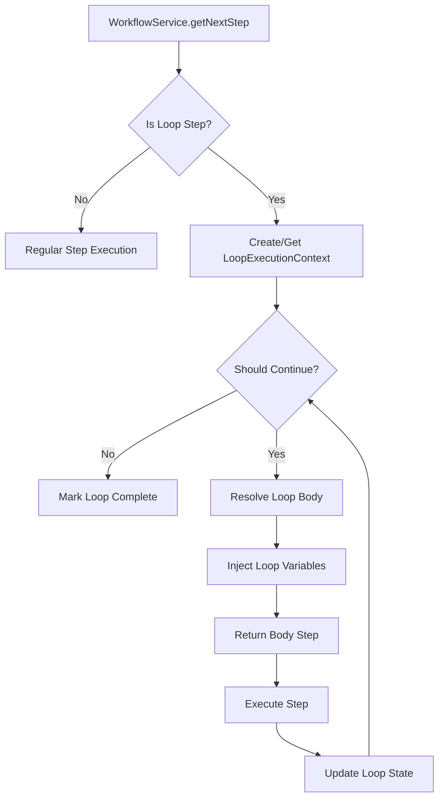
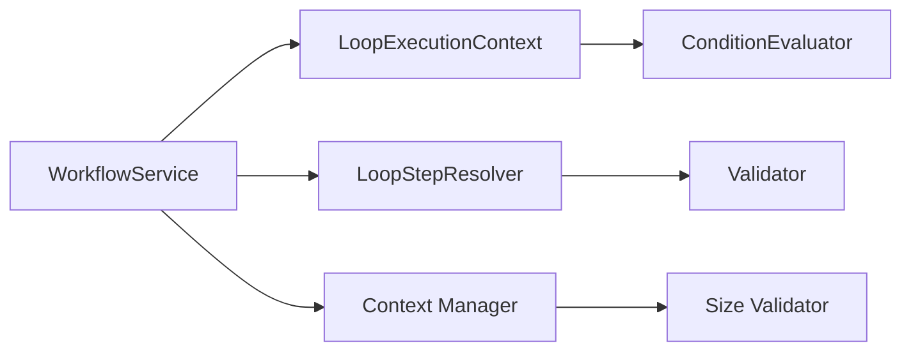

# Loop Implementation Architectural Design

## Version: 1.0.0
**Date**: 2024-12-20  
**Status**: Draft  
**Specification**: [loop-implementation-spec.md](../specs/loop-implementation-spec.md)

## 1. High-Level Approach

The loop implementation extends Workrail's existing workflow execution model by introducing a new `loop` step type that maintains the stateless architecture while enabling iterative patterns. The design leverages existing components wherever possible:

- **Extends** the current step execution logic rather than replacing it
- **Reuses** the condition evaluator for loop conditions
- **Maintains** the stateless model with enhanced context management
- **Preserves** backward compatibility through schema versioning

### Core Design Principles
1. **Minimal Disruption**: Changes localized to specific components
2. **Stateless Execution**: Loop state tracked in context, not persisted
3. **Safety First**: Hard limits prevent resource exhaustion
4. **Progressive Enhancement**: Existing workflows unaffected

## 2. Component Breakdown

### 2.1 New Components

#### LoopStepResolver
**Location**: `src/application/services/loop-step-resolver.ts`
```typescript
export class LoopStepResolver {
  resolveStepReference(workflowId: string, stepId: string): WorkflowStep | null
  validateLoopBody(workflow: Workflow, loopStep: LoopStep): ValidationResult
}
```
**Purpose**: Handles loop-specific step reference resolution and validation

#### LoopExecutionContext
**Location**: `src/application/services/loop-execution-context.ts`
```typescript
export class LoopExecutionContext {
  constructor(loopId: string, loopConfig: LoopConfig)
  incrementIteration(): void
  getCurrentState(): LoopState
  shouldContinue(): boolean
  injectVariables(context: ConditionContext): ConditionContext
}
```
**Purpose**: Manages loop-specific state and context variables

### 2.2 Modified Components

#### WorkflowService
**Changes to**: `src/application/services/workflow-service.ts`
- Enhance `getNextStep()` to handle loop steps
- Add loop state management logic
- Integrate with LoopStepResolver

#### WorkflowValidator (within ValidationEngine)
**Changes to**: `src/application/services/validation-engine.ts`
- Add loop-specific validation rules
- Validate step references exist
- Check for nested loops (disallowed)

#### Schema Validator
**Changes to**: `src/validation/schemas.ts`
- Support dual schema versions (0.0.1 and 0.1.0)
- Add loop step type validation

## 3. Data Models

### 3.1 Type Extensions

#### LoopStep (extends WorkflowStep)
```typescript
interface LoopStep extends WorkflowStep {
  type: 'loop';
  loop: LoopConfig;
  body: string | WorkflowStep[];
}

interface LoopConfig {
  type: 'while' | 'until' | 'for' | 'forEach';
  condition?: Condition;           // for while/until
  items?: string;                  // for forEach (context variable name)
  count?: number | string;         // for 'for' loops
  maxIterations: number;           // safety limit
  iterationVar?: string;           // custom iteration counter name
  itemVar?: string;                // custom item variable name
  indexVar?: string;               // custom index variable name
}
```

#### Enhanced Context Structure
```typescript
interface LoopState {
  [loopId: string]: {
    iteration: number;
    started: number;              // timestamp for timeout tracking
    items?: any[];                 // for forEach loops
    index?: number;                // current array index
    warnings?: string[];           // accumulated warnings
  }
}

interface EnhancedContext extends ConditionContext {
  _loopState?: LoopState;
  _warnings?: {
    loops?: {
      [loopId: string]: string[];
    }
  };
  _contextSize?: number;           // tracked for validation
}
```

### 3.2 Schema Changes

The workflow schema v0.1.0 adds:
```json
{
  "definitions": {
    "loopStep": {
      "type": "object",
      "properties": {
        "type": { "const": "loop" },
        "id": { "$ref": "#/definitions/stepId" },
        "title": { "type": "string" },
        "loop": { "$ref": "#/definitions/loopConfig" },
        "body": {
          "oneOf": [
            { "type": "string" },
            { "type": "array", "items": { "$ref": "#/definitions/workflowStep" } }
          ]
        }
      }
    }
  }
}
```

## 4. API Contracts

### 4.1 No External API Changes

The loop implementation maintains existing API contracts:
- `workflow_list`: No changes
- `workflow_get`: Returns workflows with loop steps
- `workflow_next`: Enhanced to handle loop execution
- `workflow_validate`: Enhanced to validate loop outputs

### 4.2 Internal Contract Changes

#### Enhanced getNextStep Response
When returning a loop step:
```typescript
{
  step: {
    type: 'loop',
    id: 'process-items',
    title: 'Process Each Item',
    loop: { /* config */ },
    body: 'process-single-item'
  },
  guidance: {
    prompt: 'Execute loop body for current iteration',
    loopContext: {
      iteration: 3,
      totalItems: 10,
      currentItem: { /* ... */ }
    }
  },
  isComplete: false
}
```

## 5. Key Interactions

### 5.1 Loop Execution Flow



### 5.2 Component Interaction Diagram



## 6. Integration Points

### 6.1 Storage Layer Integration
- No changes to storage interfaces
- Loop steps stored as regular workflow steps
- Schema version stored in workflow metadata

### 6.2 Validation Integration
- ValidationEngine extended with loop rules
- Reuses existing validation patterns
- Adds new validation types for loops

### 6.3 Condition Evaluator Integration
- No changes to condition evaluator
- Loop conditions use existing syntax
- New context variables accessible to conditions

### 6.4 Testing Integration
- Extends existing test patterns
- New test utilities for loop scenarios
- Performance benchmarks for iterations

## 7. Clarification Decisions Impact

### 7.1 Loop-Specific References
**Decision**: Loop-specific implementation only  
**Design Impact**: 
- LoopStepResolver limited to loop body resolution
- No general step registry needed
- Simpler validation logic

### 7.2 Stateless Model
**Decision**: Keep stateless with validation  
**Design Impact**:
- Loop state in context, not persisted
- Context size monitoring added
- No changes to storage layer

### 7.3 Schema Versioning
**Decision**: Version 0.0.1 → 0.1.0  
**Design Impact**:
- Dual version support in validators
- Version detection logic added
- Migration tool as separate utility

### 7.4 Graceful Exit
**Decision**: Exit with warnings  
**Design Impact**:
- Warning accumulation in context
- No exceptions on limits
- Workflow continues after loop

### 7.5 No Nested Loops
**Decision**: Postpone nested loops  
**Design Impact**:
- Simplified state management
- Single-level loop validation
- Cleaner context structure

## 8. Complexity Considerations

### 8.1 Performance Optimization
- Lazy evaluation for large forEach arrays
- Context size checked every 10 iterations
- Efficient state updates using immutable patterns

### 8.2 Error Boundary Design
- Each loop execution wrapped in try-catch
- Errors logged but workflow continues
- Failed iterations tracked in context

### 8.3 Migration Complexity
- Auto-detection of schema version
- In-place migration where possible
- Clear migration error messages

### 8.4 Testing Complexity
- Mock loop contexts for unit tests
- Real execution for integration tests
- Deterministic iteration for tests

## 9. Security Considerations

### 9.1 Resource Limits
- Hard cap on iterations (1000)
- Context size limit (256KB)
- Execution timeout per loop (5 minutes default)

### 9.2 Input Validation
- Loop configuration strictly validated
- Step references validated against workflow
- Array access bounds checking for forEach

## 10. Implementation Priority

### Phase 1 Critical Path
1. Schema update and versioning
2. Basic loop step recognition
3. LoopExecutionContext implementation
4. While loop support

### Phase 2 Core Features
1. LoopStepResolver implementation
2. Context variable injection
3. All loop types (until, for, forEach)
4. Context size monitoring

### Phase 3 Enhancement
1. Multi-step body support
2. Performance optimizations
3. Comprehensive validation
4. Migration tooling

This design provides a solid foundation for implementing loops while maintaining Workrail's architectural principles and enabling future enhancements. 