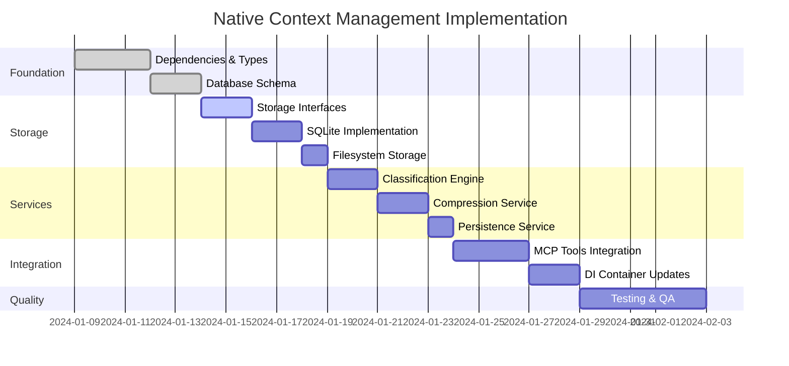

# Native Context Management Implementation Plan

**Version:** 1.0  
**Date:** 2024-01-09  
**Based on:** spec.md v1.0, design.md v1.0, Phase 2 clarifications, Large complexity assessment  

---

## Executive Summary

**5-Phase Implementation Timeline**



**Key Milestones**: Foundation (Week 1) → Storage (Week 2) → Services (Week 3) → Integration (Week 4) → Testing (Week 5)

---

## 1. Goal Clarification

### Primary Objective
Implement a native context management system for WorkRail MCP server that automatically saves and restores workflow context across chat sessions, eliminating manual CONTEXT.md file management and enabling seamless workflow resumption when users hit LLM context limits.

### Success Criteria (From Specification)
1. **Functional**: Save/load workflow context via 4 new MCP tools with automatic classification
2. **Performance**: <100ms save, <500ms load operations (optimization goals)
3. **Usability**: Zero-config setup working on macOS/Windows/Linux
4. **Reliability**: Concurrent access handling, storage quotas, >80% test coverage
5. **Integration**: Seamless integration with existing ContextOptimizer without breaking workflows

### Key Assumptions (From Clarifications)
- **Separate Service Pattern**: ContextPersistenceService alongside (not extending) ContextOptimizer
- **Storage Strategy**: Fixed paths with environment overrides, optional SQLite with filesystem fallback
- **Session Correlation**: Hash-based derivation (`hash(workflowId + initialContextHash)`) with fallbacks
- **Performance Priority**: Features may be deferred if they impact optimization targets
- **MVP Scope**: No legacy CONTEXT.md migration, complete replacement approach

### Architecture Integration Points
- **DI Container**: Extend existing `AppContainer` with context management services
- **Storage Pattern**: Follow existing decorator composition (`CachingWorkflowStorage` model)
- **MCP Tools**: Follow patterns in `mcp-server.ts:182-330` for tool definitions
- **Error Handling**: Extend existing `MCPError` patterns with context-specific errors

---

## 2. Impact Assessment

### 2.1 Affected Codebase Components

#### Files to Modify
- **`package.json`**: Add `better-sqlite3` and `keytar` dependencies
- **`src/container.ts`**: Extend `AppContainer` interface and factory function
- **`src/mcp-server.ts`**: Add 4 new MCP tool definitions and handlers
- **`src/application/services/context-optimizer.ts`**: Add persistence integration methods
- **`src/core/error-handler.ts`**: Add context-specific error classes

#### New Files to Create (8 Core Components)
- **`src/types/context-types.ts`**: Type definitions for context management
- **`src/application/services/context-management-service.ts`**: Main facade service
- **`src/application/services/context-persistence-service.ts`**: Core persistence logic
- **`src/application/services/classification-engine.ts`**: Context classification
- **`src/application/services/compression-service.ts`**: Context compression
- **`src/infrastructure/storage/context-storage.ts`**: Storage interface definitions
- **`src/infrastructure/storage/hybrid-context-storage.ts`**: Main storage implementation
- **`src/infrastructure/storage/sqlite-metadata-storage.ts`**: SQLite metadata storage

#### Database Infrastructure
- **`src/infrastructure/storage/migrations/002_context_schema.sql`**: Context management schema
- **`src/infrastructure/storage/sqlite-migrator.ts`**: Database migration system
- **Configuration files**: Default classification rules, compression settings

### 2.2 Dependencies Analysis

#### Required Dependencies
- **`better-sqlite3`**: Database operations (fallback to filesystem if unavailable)
- **`keytar`**: OS keychain integration for encryption (optional)
- **`crypto`**: Built-in Node.js module for hashing and checksums

#### Dependency Versioning Policy
All dependencies will be pinned to exact versions in package.json (e.g., `"better-sqlite3": "9.4.3"` instead of `"^9.4.3"`) to ensure consistent builds and prevent "works on my machine" issues. This aligns with Decision 10 from the design phase for maximum reliability and reproducibility.

#### Risk Assessment
| **Risk** | **Probability** | **Impact** | **Mitigation** |
|----------|----------------|------------|----------------|
| SQLite build failure | Medium | Medium | Filesystem fallback, graceful degradation |
| Performance regression | Medium | High | Benchmarking, feature deferral protocols |
| Integration conflicts | Low | High | Follow existing patterns, comprehensive testing |
| Cross-platform issues | Medium | Medium | Platform-specific handling, extensive testing |

### 2.3 Backward Compatibility
- **Existing workflows**: Continue functioning unchanged
- **ContextOptimizer**: Enhanced with new methods, existing functionality preserved
- **MCP API**: New tools added, existing tools unaffected
- **Storage**: Completely separate from workflow storage, no conflicts

---

## 3. Implementation Strategy

### 3.0 Reusable Implementation Patterns

#### Common Development Patterns
- **Follow Existing Patterns**: Leverage established patterns in `src/container.ts`, `src/mcp-server.ts`, and storage decorators
- **Interface-First Development**: Define TypeScript interfaces before concrete implementations
- **Graceful Degradation**: Always provide fallback mechanisms for optional dependencies
- **Immutable Data Handling**: Use `Object.freeze()` and create new instances instead of mutating existing data
- **Error Boundary Pattern**: Wrap operations in try-catch with appropriate MCPError subclasses
- **Atomic Operations**: Use temp-file-then-rename pattern for filesystem operations, transactions for database

#### Service Constructor Pattern
```typescript
// Standard constructor pattern for all context services
constructor(
  private readonly dependency1: IDependency1,
  private readonly dependency2: IDependency2,
  private readonly config?: ServiceConfig
) {}
```

### Phase 1: Foundation & Dependencies (Week 1)

#### Step 1.1: Dependency Setup
**Task**: Add required dependencies and configure build system  
*Rationale*: Establish foundation before any code implementation  
**Inputs**: `package.json`, build configuration  
**Outputs**: Updated dependencies, build scripts for native modules  

**Implementation Details**:
```bash
# Add dependencies
npm install better-sqlite3 @types/better-sqlite3
npm install keytar @types/keytar  # Optional

# Update package.json scripts for cross-platform builds
# Add fallback handling for native module build failures
```

#### Step 1.2: Type Definitions
**Task**: Create comprehensive TypeScript type definitions  
*Rationale*: Establish contracts before implementation, enable IntelliSense  
**Inputs**: Design document interface specifications  
**Outputs**: `src/types/context-types.ts` with all core interfaces  

**Key Types**:
- `ContextLayer` enum (CRITICAL/IMPORTANT/USEFUL/EPHEMERAL)
- `ClassifiedContext`, `CompressedBlob`, `CheckpointMetadata`
- `SessionInfo`, `ClassificationRules`, `ContextConfig`

#### Step 1.3: Database Schema & Migration System
**Task**: Implement SQLite schema and migration infrastructure  
*Rationale*: Database foundation required for all storage operations  
**Inputs**: Design document schema specification  
**Outputs**: Migration files, migration runner, schema validation  

**Schema Components**:
- `sessions` table with proper indexes
- `checkpoint_metadata` table with foreign keys
- `session_locks` table for concurrency
- Migration runner following existing patterns

### Phase 2: Core Storage Layer (Week 2)

#### Step 2.1: Storage Interfaces
**Task**: Implement core storage interfaces and contracts  
*Rationale*: Define clear boundaries before concrete implementations  
**SOLID Notes**: **I (Interface Segregation)** - Separate concerns into focused interfaces (metadata vs blob storage)
**Inputs**: Type definitions, design patterns  
**Outputs**: `IContextStorage`, `IMetadataStorage`, `IBlobStorage` interfaces  

#### Step 2.2: SQLite Metadata Storage
**Task**: Implement SQLite-based metadata storage with concurrency handling  
*Rationale*: Primary storage backend for metadata operations  
**SOLID Notes**: **S (Single Responsibility)** - Handles only SQLite metadata operations, **D (Dependency Inversion)** - Depends on Database abstraction
**Inputs**: Database schema, migration system  
**Outputs**: `SqliteMetadataStorage` with locking, transactions, error handling  

**Key Features**:
- Session management with automatic lock acquisition
- Atomic operations with rollback capability
- Connection pooling (max 10 connections per design)
- Graceful fallback to filesystem if SQLite unavailable

#### Step 2.3: Filesystem Blob Storage
**Task**: Implement atomic file operations for context blob storage  
*Rationale*: Efficient storage for large context data  
**Inputs**: Platform-specific path handling requirements  
**Outputs**: `FileSystemBlobStorage` with atomic writes, checksums  

**Key Features**:
- Atomic writes (temp file → rename pattern)
- SHA-256 checksums for corruption detection
- Platform-specific path resolution
- Optional encryption integration hooks

#### Step 2.4: Hybrid Storage Composition
**Task**: Compose metadata and blob storage into unified interface  
*Rationale*: Provide single interface following existing decorator pattern  
**Inputs**: Component storage implementations  
**Outputs**: `HybridContextStorage` with coordinated operations  

### Phase 3: Service Layer Implementation (Week 3)

#### Step 3.1: Classification Engine
**Task**: Implement context classification using pattern matching and heuristics  
*Rationale*: Core intelligence for organizing context by importance  
**SOLID Notes**: **S (Single Responsibility)** - Handles only context classification concerns, **O (Open-Closed)** - Extensible via rule configuration
**Inputs**: Classification rules, context objects  
**Outputs**: `ClassificationEngine` with configurable rules  

**Key Features**:
- Regex pattern matching for context keys
- Content heuristics (length, keyword density)
- Configurable rules loading from JSON
- Agent override capability via `workflow_mark_critical`

#### Step 3.2: Compression Service
**Task**: Implement layer-specific compression strategies  
*Rationale*: Optimize storage usage while preserving important data  
**SOLID Notes**: **S (Single Responsibility)** - Handles only compression/decompression, **L (Liskov Substitution)** - Interchangeable compression strategies
**Inputs**: Classified context data  
**Outputs**: `CompressionService` with gzip and selective compression  

**Key Features**:
- Layer-specific compression (CRITICAL=none, EPHEMERAL=aggressive)
- Configurable compression levels
- Compression ratio tracking for performance monitoring
- Graceful fallback to no compression if needed

#### Step 3.3: Context Persistence Service
**Task**: Implement core persistence logic coordinating classification and compression  
*Rationale*: Central orchestration of context processing pipeline  
**Inputs**: Raw context objects, storage interfaces  
**Outputs**: `ContextPersistenceService` with full pipeline  

**Key Features**:
- Context classification → compression → storage pipeline
- Session ID generation using `hash(workflowId + initialContextHash)`
- Immutable data handling throughout pipeline
- Performance monitoring with timing measurements

#### Step 3.4: Context Management Service (Facade)
**Task**: Implement main service facade coordinating all context operations  
*Rationale*: Simplified interface for MCP tool integration  
**Inputs**: All component services  
**Outputs**: `ContextManagementService` implementing `IContextManagementService`  

### Phase 4: MCP Integration (Week 4)

#### Step 4.1: ContextOptimizer Enhancement
**Task**: Add persistence integration methods to existing ContextOptimizer  
*Rationale*: Enable handoff between runtime and persistence contexts  
**Inputs**: Existing ContextOptimizer, new persistence requirements  
**Outputs**: Enhanced ContextOptimizer with `prepareForPersistence`/`restoreFromPersistence`  

**Key Features**:
- `prepareForPersistence`: Create immutable copy, remove runtime metadata
  ```typescript
  static prepareForPersistence(context: EnhancedContext): PersistableContext {
    const persistable = { ...context };
    delete persistable._currentLoop; // Runtime-only data
    return Object.freeze(persistable) as PersistableContext; // Ensure immutability with Object.freeze()
  }
  ```
- `restoreFromPersistence`: Rehydrate with runtime metadata
  ```typescript  
  static restoreFromPersistence(persistable: PersistableContext): EnhancedContext {
    // Creates new immutable instance, never mutates input
    return ContextOptimizer.createEnhancedContext(persistable, {
      _contextSize: JSON.stringify(persistable).length
    });
  }
  ```
- Maintain backward compatibility with existing methods
- Immutability enforcement with `Object.freeze()` throughout pipeline

#### Step 4.2: MCP Tool Definitions
**Task**: Add 4 new MCP tool definitions following existing patterns  
*Rationale*: Expose context management via standard MCP interface  
**Inputs**: Existing tool patterns, API specifications  
**Outputs**: Tool definitions in `mcp-server.ts`  

**Tools to Implement**:
- `workflow_checkpoint_save`: Save context with metadata
- `workflow_checkpoint_load`: Load by checkpoint ID or session ID
- `workflow_checkpoint_list`: List checkpoints with pagination
- `workflow_mark_critical`: Mark context keys as critical

#### Step 4.3: Tool Handler Implementation
**Task**: Implement MCP tool handlers in WorkflowOrchestrationServer  
*Rationale*: Connect MCP tools to context management services  
**Inputs**: Tool definitions, context management service  
**Outputs**: Handler methods with error handling  

#### Step 4.4: DI Container Integration
**Task**: Integrate all context services into existing dependency injection container  
*Rationale*: Follow existing patterns for service composition  
**Inputs**: All implemented services, existing container structure  
**Outputs**: Extended `AppContainer` with context services  

### Phase 5: Testing & Quality Assurance (Week 5)

#### Step 5.1: Unit Tests Implementation
**Task**: Implement comprehensive unit tests following strategy outlined in Section 4.1  
*Rationale*: Ensure individual component reliability, achieve >80% coverage  
**Inputs**: All service implementations, testing framework from Section 4  
**Outputs**: Unit test suites with >80% coverage  

#### Step 5.2: Integration Tests Implementation  
**Task**: Implement end-to-end integration tests per strategy in Section 4.2  
*Rationale*: Verify component interactions and data flow  
**Inputs**: Full system integration, test scenarios from Section 4.2  
**Outputs**: Integration test suite covering complete workflows  

#### Step 5.3: Performance & Chaos Testing
**Task**: Implement performance benchmarks and chaos testing per Sections 4.3-4.4  
*Rationale*: Verify optimization targets and system resilience  
**Inputs**: Representative context data sets, chaos testing framework  
**Outputs**: Performance benchmarks, resilience test results  

---

## 4. Comprehensive Testing Strategy

### 4.1 Unit Testing Framework
**Framework**: Jest (existing project standard)  
**Coverage Target**: >80% for all new components  
**Patterns**: Follow existing patterns in `tests/unit/workflow-service.test.ts`  
**Database Testing**: In-memory SQLite (`:memory:` mode) for isolation

#### Storage Layer Tests
```typescript
describe('SqliteMetadataStorage', () => {
  let storage: SqliteMetadataStorage;
  
  beforeEach(() => {
    // Use in-memory SQLite for isolation
    storage = new SqliteMetadataStorage(':memory:');
  });
  
  test('should save and retrieve checkpoint metadata', async () => {
    // Test atomic operations, foreign key constraints
  });
  
  test('should handle concurrent access with locking', async () => {
    // Test pessimistic locking for writes
  });
});
```

#### Service Layer Tests
```typescript
describe('ClassificationEngine', () => {
  test('should classify context keys by patterns', () => {
    const engine = new ClassificationEngine();
    const context = { userGoal: 'test', debugLog: 'info' };
    const classified = engine.classify(context);
    
    expect(classified.CRITICAL).toHaveProperty('userGoal');
    expect(classified.EPHEMERAL).toHaveProperty('debugLog');
  });
});
```

### 4.2 Integration Testing
**Approach**: End-to-end workflows using real SQLite with temporary files  
**Isolation**: Per-test database creation/cleanup  

#### Test Scenarios
1. **Complete Persistence Cycle**: Save context → classify → compress → store → load → verify
2. **Concurrency**: Multiple agents accessing same session simultaneously
3. **Error Recovery**: Storage failures, corruption detection, graceful degradation
4. **Platform Compatibility**: Path handling, file permissions across OS

### 4.3 Performance Testing
**Framework**: Custom benchmarking with statistical analysis  
**Integration**: Part of regular test suite for continuous validation  

#### Benchmarks
- **Save Operation**: Measure classification + compression + storage time
- **Load Operation**: Measure retrieval + decompression + restoration time
- **Compression Ratio**: Track effectiveness across different context types
- **Memory Usage**: Monitor heap usage during operations

### 4.4 Chaos Engineering and Resilience Testing
**Approach**: Proactive resilience testing to catch edge cases early  
**Integration**: Part of E2E test suite with controlled failure injection  

**Chaos Testing Scenarios**:
- **Disk Full**: Simulate storage exhaustion during checkpoint save operations
- **Database Corruption**: Inject corruption into SQLite files, verify recovery mechanisms
- **Network Failures**: Test behavior when remote dependencies (if any) are unavailable
- **Memory Pressure**: Run operations under constrained memory conditions
- **Concurrent Failures**: Multiple agents accessing corrupted or locked sessions
- **Permission Failures**: Simulate file system permission errors during storage operations

---

## 5. Failure Handling

### 5.1 Development Failures

#### Dependency Build Failures
**Scenario**: SQLite or keytar fails to build on target platform  
**Response**:
1. Document exact error and platform details
2. Implement filesystem fallback for SQLite functionality
3. Continue development with graceful degradation
4. Add platform-specific build documentation

#### Performance Target Misses
**Scenario**: Save/load operations exceed 100ms/500ms targets  
**Response**:
1. Profile operations to identify bottlenecks
2. Implement performance optimizations (connection pooling, batch operations)
3. Consider feature deferral per clarified requirements (performance priority)
4. Document optimization recommendations for future iterations

#### Integration Conflicts
**Scenario**: Changes break existing workflow functionality  
**Response**:
1. Immediately revert problematic changes
2. Analyze conflict using isolated test cases
3. Refactor integration approach to maintain backward compatibility
4. Add specific regression tests for affected functionality

### 5.2 Testing Failures

#### Unit Test Failures
**Protocol**:
1. **Immediate**: Stop development, analyze root cause
2. **Fix**: Address underlying issue, not just test symptoms
3. **Verify**: Ensure fix doesn't break other tests
4. **Document**: Add test case if gap identified

#### Integration Test Failures
**Protocol**:
1. **Isolate**: Determine if failure is environmental or code-related
2. **Reproduce**: Create minimal reproduction case
3. **Escalate**: If system-level issue, document and implement workaround
4. **Validate**: Ensure fix works across all target platforms

#### Performance Test Failures
**Protocol**:
1. **Analyze**: Profile to identify performance bottlenecks
2. **Optimize**: Implement targeted optimizations
3. **Defer**: If optimization insufficient, defer non-critical features
4. **Document**: Record optimization attempts and results

### 5.3 Production Deployment Failures

#### Storage Initialization Failures
**Detection**: Startup monitoring, health checks  
**Response**: Graceful fallback to in-memory mode with user notification  
**Recovery**: Automatic retry with exponential backoff  

#### Data Corruption
**Detection**: Checksum validation, schema validation  
**Response**: Mark corrupted data, attempt recovery from backup metadata  
**Recovery**: Rebuild metadata index from filesystem scan  

#### Quota Exceeded
**Detection**: Pre-write quota checks  
**Response**: Trigger automatic cleanup, retry operation once  
**Recovery**: User notification with manual cleanup options  

#### Chaos Engineering and Resilience Testing
**Approach**: Proactive resilience testing to catch edge cases early  
**Integration**: Part of E2E test suite with controlled failure injection  

**Chaos Testing Scenarios**:
- **Disk Full**: Simulate storage exhaustion during checkpoint save operations
- **Database Corruption**: Inject corruption into SQLite files, verify recovery mechanisms
- **Network Failures**: Test behavior when remote dependencies (if any) are unavailable
- **Memory Pressure**: Run operations under constrained memory conditions
- **Concurrent Failures**: Multiple agents accessing corrupted or locked sessions
- **Permission Failures**: Simulate file system permission errors during storage operations

**Failure Injection Tools**:
```typescript
// Example chaos testing helper
class ChaosTestHelper {
  static simulateDiskFull(): void {
    // Mock fs operations to throw ENOSPC errors
  }
  
  static corruptDatabase(dbPath: string): void {
    // Inject random bytes into SQLite file
  }
  
  static simulatePermissionError(): void {
    // Mock fs.chmod to fail with EACCES
  }
}
```

### 5.4 Immutability Guidelines for Recovery
All failure recovery procedures must use immutable data handling to prevent state corruption:

- **Rebuild Operations**: Always create new immutable snapshots, never mutate existing data
- **Rollback Procedures**: Use `Object.freeze()` on recovery state to prevent accidental mutations
- **Error State**: Maintain immutable error context for debugging without affecting system state
- **Concurrent Recovery**: Ensure multiple recovery processes don't interfere via immutable boundaries

```typescript
// Example recovery with immutability
class RecoveryManager {
  static async recoverFromCorruption(sessionId: string): Promise<SessionInfo> {
    const corruptedState = await this.loadCorruptedState(sessionId);
    const cleanState = Object.freeze({ ...corruptedState, status: 'recovered' }); // Immutable recovery
    return cleanState;
  }
}
```

---

## 6. Final Review Checklist

### 6.1 Functional Requirements ✅
- [ ] **MCP Tools**: All 4 tools (`save`, `load`, `list`, `mark_critical`) implemented and functional
- [ ] **Context Classification**: Automatic classification working with 90%+ accuracy on test datasets
- [ ] **Compression**: Achieving 5-10x compression ratio with minimal information loss
- [ ] **Session Management**: Session correlation and concurrency handling operational
- [ ] **Storage Operations**: Save/load operations working reliably across platforms
- [ ] **Error Handling**: All error scenarios handled gracefully with appropriate error codes

### 6.2 Performance Requirements ✅
- [ ] **Save Performance**: <100ms for typical context (1-10KB) on standard hardware
- [ ] **Load Performance**: <500ms including decompression for typical context
- [ ] **Classification Speed**: <10ms for context classification operations
- [ ] **Storage Efficiency**: Context blobs compressed to <20% of original size
- [ ] **Memory Usage**: Context management layer using <50MB heap space
- [ ] **Database Performance**: Metadata queries responding within 10ms

### 6.3 Integration Requirements ✅
- [ ] **DI Container**: All services properly registered and injectable
- [ ] **ContextOptimizer**: Integration working without breaking existing functionality
- [ ] **MCP Server**: New tools integrated following existing patterns
- [ ] **Error System**: Context errors extend existing MCPError hierarchy properly
- [ ] **Storage Pattern**: Follows existing decorator composition model
- [ ] **Backward Compatibility**: Existing workflows continue to function unchanged

### 6.4 Quality Assurance ✅
- [ ] **Test Coverage**: >80% unit test coverage for all new components
- [ ] **Integration Tests**: Complete save/load cycles tested end-to-end
- [ ] **Concurrency Tests**: Multi-agent scenarios tested and verified
- [ ] **Platform Tests**: Functionality verified on macOS, Windows, Linux
- [ ] **Performance Tests**: Benchmarks confirm optimization targets met
- [ ] **Error Tests**: All failure scenarios tested and handled appropriately

### 6.5 Production Readiness ✅
- [ ] **Zero Config**: Default setup works without configuration
- [ ] **Cross Platform**: Installation and operation verified on all target platforms
- [ ] **Graceful Degradation**: Fallback behaviors working when optional dependencies unavailable
- [ ] **Documentation**: All public APIs documented with examples
- [ ] **Logging**: Appropriate logging for monitoring and debugging
- [ ] **Security**: Input validation, file permissions, optional encryption functional

### 6.6 Deployment Verification ✅
- [ ] **Dependency Installation**: All required packages install successfully
- [ ] **Database Migration**: Schema creation and migration working properly
- [ ] **Storage Creation**: Automatic directory and file creation working
- [ ] **Tool Discovery**: MCP tools appear in client tool listings
- [ ] **Basic Workflow**: Can successfully save and load a simple context
- [ ] **Monitoring**: Performance and error metrics being captured

---

## Success Metrics

**Implementation Complete When**:
1. All checklist items verified ✅
2. Integration tests passing on CI/CD pipeline
3. Performance benchmarks meeting optimization targets
4. Zero-config installation working on all platforms
5. Documentation complete and reviewed
6. Ready for production deployment

**Estimated Timeline**: 5 weeks (25 development days)  
**Risk Buffer**: +1 week for unexpected complexities  
**Total Project Duration**: 6 weeks maximum  

This implementation plan provides a systematic approach to delivering the native context management system while maintaining high quality standards and backward compatibility with the existing WorkRail architecture. 