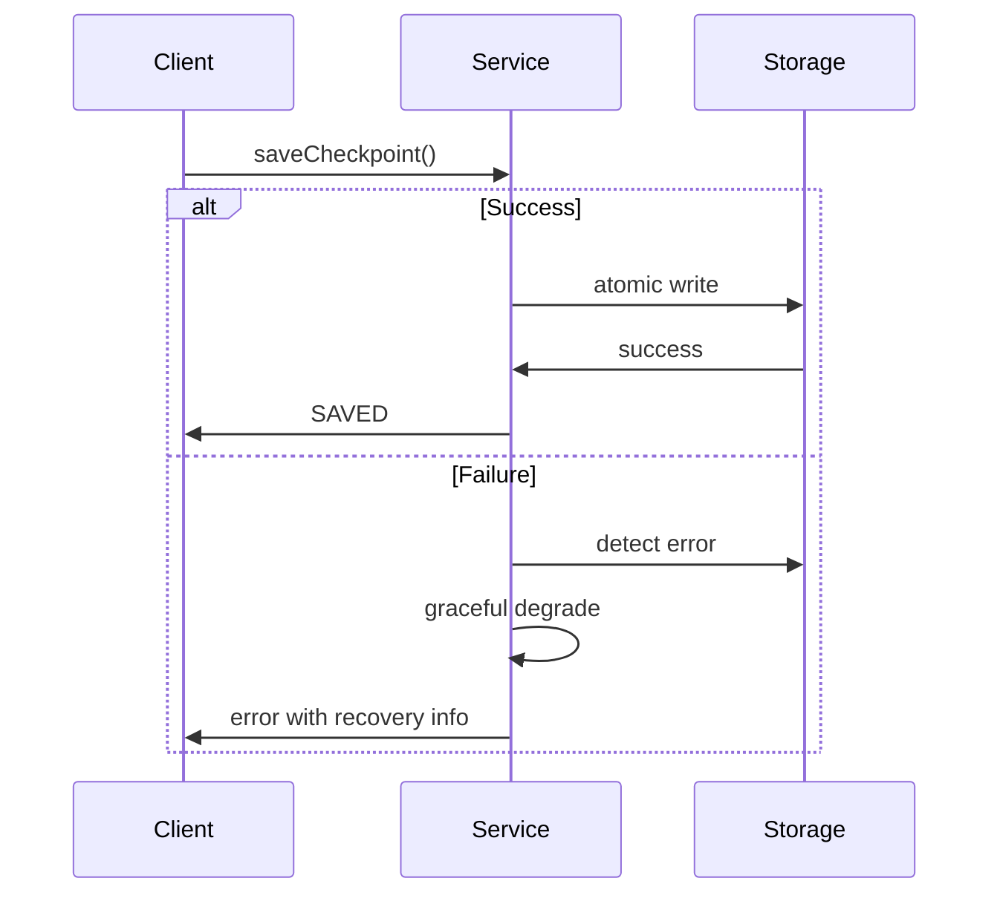

# Native Context Management System - Implementation Specification

**Version:** 1.0  
**Date:** 2024-01-09  
**Complexity:** Large  

## Executive Summary

Implement a native context management system for the WorkRail MCP server to replace manual CONTEXT.md files. The system will provide automatic context persistence, intelligent compression, and seamless workflow resumption while maintaining the MCP's stateless architecture and zero-configuration principles.

## 1. Task Description

### Primary Objective
Develop a context management layer that automatically saves and restores workflow context across chat sessions, enabling users to resume complex workflows when they hit LLM context limits without manual intervention.

### Core Components
1. **Hybrid Storage Backend**: SQLite metadata database + filesystem blob storage
2. **Four-Layer Context Classification**: CRITICAL/IMPORTANT/USEFUL/EPHEMERAL hierarchy
3. **Intelligent Compression**: Automatic context compression with configurable strategies
4. **MCP Tools API**: Four new tools for context operations
5. **Session Management**: Multi-agent concurrent access handling
6. **Optional Encryption**: OS keychain integration for sensitive workflows
7. **Storage Management**: Quotas, cleanup policies, and performance optimization

## 2. Architecture Integration

### 2.1 Existing Patterns Alignment
- **Follow storage decorator pattern**: `ContextStorage` similar to `CachingWorkflowStorage(SchemaValidatingWorkflowStorage(...))`
- **Integrate with DI container**: Add `IContextManagementService` to `AppContainer`
- **Extend MCP tool definitions**: Follow patterns in `mcp-server.ts:140-306`
- **Maintain service separation**: Create `ContextPersistenceService` alongside existing `ContextOptimizer`

### 2.2 Service Architecture
```typescript
// New services to be added to container.ts
interface AppContainer {
  // ... existing services ...
  contextStorage: IContextStorage;
  contextManagementService: IContextManagementService;
  contextPersistenceService: IContextPersistenceService;
}
```

### 2.3 Integration with ContextOptimizer
- **Handoff Protocol**: ContextOptimizer prepares context via `prepareForPersistence()` → ContextPersistenceService handles storage
- **Restoration**: ContextPersistenceService loads raw data → ContextOptimizer rehydrates via `restoreFromPersistence()`
- **Separation of Concerns**: Runtime optimization vs. persistence logic remain distinct

### 2.4 SOLID Alignment
- **Single Responsibility (S)**: ContextPersistenceService handles only persistence
- **Open-Closed (O)**: Extend via decorators without modifying core
- **Liskov Substitution (L)**: Services interchangeable via interfaces
- **Interface Segregation (I)**: Minimal, focused tool interfaces
- **Dependency Inversion (D)**: High-level modules depend on abstractions

### 2.5 References and Standards
- SOLID Principles: Clean Architecture by Robert C. Martin
- OWASP Secure Storage Cheat Sheet for encryption
- ACID Transactions for storage integrity
- ISO 25010 for system quality attributes

## 3. Functional Requirements

### 3.1 MCP Tools API

#### 3.1.1 workflow_checkpoint_save
```typescript
Input: {
  sessionId?: string,        // Auto-derived if not provided
  context: object,           // Current workflow context
  metadata?: {
    name?: string,
    tags?: string[]
  },
  force?: boolean           // Save even if unchanged
}

Output: {
  checkpointId: string,
  sessionId: string,
  status: "SAVED" | "SKIPPED_UNCHANGED",
  sizeBytes?: number
}
```

#### 3.1.2 workflow_checkpoint_load
```typescript
Input: {
  checkpointId?: string,    // Specific checkpoint
  sessionId?: string        // Latest checkpoint from session
}

Output: {
  checkpointId: string,
  sessionId: string,
  context: object,
  metadata: object
}
```

#### 3.1.3 workflow_checkpoint_list
```typescript
Input: {
  sessionId: string,
  limit?: number,           // Default: 20
  offset?: number           // Default: 0
}

Output: Array<{
  checkpointId: string,
  sessionId: string,
  createdAt: string,
  sizeBytes: number,
  metadata: object
}>
```

#### 3.1.4 workflow_mark_critical
```typescript
Input: {
  sessionId: string,
  contextKey: string
}

Output: {
  status: "SUCCESS" | "KEY_NOT_FOUND",
  message: string
}
```

Note: Tools follow Interface Segregation Principle by exposing minimal, focused interfaces with no unrelated parameters.

### 3.2 Context Classification
- **CRITICAL (30% budget)**: Never compressed/dropped - user goals, core decisions
- **IMPORTANT (40% budget)**: Compressed when necessary - reasoning chains, plans
- **USEFUL (20% budget)**: Aggressively compressed - detailed analysis, examples
- **EPHEMERAL (10% budget)**: Dropped between steps - timestamps, debug logs

### 3.3 Session Management
- **Primary Strategy**: Derive sessionId from `hash(workflowId + initialContextHash)`
- **Fallback**: Accept platform-provided session IDs via tool parameters
- **Manual Override**: Allow user-provided sessionId for advanced use cases

## 4. Technical Requirements

### 4.1 Storage Strategy
- **Location**: Fixed paths (`~/.workrail/` by default) with environment variable overrides (`WORKRAIL_DATA_DIR`)
- **Database**: Optional SQLite with fallback to filesystem-only metadata (JSON index files)
- **Migration**: Custom lightweight migration system with version tracking
- **Isolation**: Shared database across workflows unless storage path is overridden

### 4.2 Dependencies
- **Required**: Add `better-sqlite3` for database functionality
- **Optional**: Add `keytar` for encryption (OS keychain integration)
- **Fallback**: Graceful degradation if native modules fail to build

### 4.3 Performance Targets (Optimization Goals)
- Checkpoint save: <100ms (average context)
- Checkpoint load: <500ms (including decompression)
- Compression: <50ms (100KB context)
- Classification: <10ms
- Features may be deferred if they impact these targets

### 4.4 Cross-Platform Compatibility
- Support macOS, Windows, Linux
- Handle platform-specific storage paths
- OS keychain integration for encryption
- Native module build fallbacks

### 4.5 Immutability Guidelines
Use immutable data structures (e.g., Object.freeze) for loaded contexts to prevent accidental mutations. Create new context copies during prepare/rehydrate flows to maintain immutability and ensure thread-safety.

### 4.6 Non-Functional Requirements
- **Availability**: 99.9% local uptime (graceful degradation on errors)
- **Scalability**: Handle up to 1000 checkpoints per session
- **Accessibility**: CLI outputs compatible with screen readers
- **Maintainability**: Follow existing code quality standards (>80% test coverage)

## 5. Implementation Constraints

### 5.1 Scope Boundaries
- **MVP Focus**: Core persistence functionality without advanced features
- **No Legacy Migration**: Complete replacement approach, no CONTEXT.md import utilities
- **Performance Priority**: Defer non-essential features if they impact performance targets
- **Zero-Config**: Must work out-of-the-box with sensible defaults

### 5.2 Integration Constraints
- **Maintain MCP Statelessness**: All state stored externally, server remains stateless
- **Backward Compatibility**: Existing workflows continue to function unchanged
- **Error Handling**: Follow existing `MCPError` patterns and error codes
- **Testing Strategy**: Follow existing patterns with in-memory SQLite for unit tests

## 6. Error Handling

### 6.1 New Error Types
```typescript
class CheckpointNotFoundError extends MCPError {
  code: CHECKPOINT_NOT_FOUND (404)
}

class SessionNotFoundError extends MCPError {
  code: SESSION_NOT_FOUND (404)
}

class StorageQuotaExceededError extends MCPError {
  code: STORAGE_QUOTA_EXCEEDED (413)
}

class StorageUnavailableError extends MCPError {
  code: STORAGE_UNAVAILABLE (503)
}
```

### 6.2 Graceful Degradation
- **SQLite Unavailable**: Fall back to filesystem-only metadata storage
- **Disk Full**: Trigger automatic cleanup and retry once
- **Encryption Failure**: Continue without encryption, log warning
- **Migration Failure**: Log error, suggest backup, continue with current schema



## 7. Security Requirements

### 7.1 Encryption (Optional)
- **Activation**: Via `WORKRAIL_ENCRYPTION=enabled` environment variable
- **Key Management**: OS keychain integration (macOS Keychain, Windows Credential Manager, Linux Secret Service)
- **Scope**: Encrypt context blobs only, metadata remains plaintext for querying
- **Fallback**: Continue without encryption if keychain unavailable

### 7.2 Access Control
- **File Permissions**: Set to 0600 for files, 0700 for directories
- **Path Sanitization**: Prevent traversal attacks in file operations
- **Input Validation**: Sanitize all checkpoint/session IDs (alphanumeric + dash/underscore only)

## 8. Testing Strategy

### 8.1 Unit Tests
- **In-Memory SQLite**: Use `:memory:` mode for fast, isolated tests
- **Mock Services**: Follow existing patterns with `IContextStorage` mocks
- **Classification Engine**: Test pattern matching and heuristics with known datasets
- **Compression**: Verify data integrity and compression ratios

### 8.2 Integration Tests
- **Real SQLite**: Use temporary database files for I/O verification
- **End-to-End Flow**: Test complete save → compress → load → decompress cycle
- **Concurrency**: Verify locking mechanisms prevent data corruption
- **Storage Failure Recovery**: Test corruption detection and recovery

### 8.3 Performance Tests
- **Benchmarks**: Integrate into regular test suite for continuous validation
- **Cross-Platform**: Run key tests on macOS, Windows, Linux
- **Chaos Testing**: Separate suite for fault injection and resilience testing

## 9. Implementation Phases

### Phase 1: Core Infrastructure
- SQLite database setup and migrations
- Basic storage layer (SqliteStorage + ContextBlobStorage)
- HybridStorage facade
- Basic MCP tools implementation
- DI container integration

### Phase 2: Intelligence Features
- Context classification engine
- Compression layer
- Enhanced tools with classification/compression
- Agent override mechanisms

### Phase 3: Production Features
- Concurrency handling and locking
- Error recovery and graceful degradation
- Configuration system
- Storage quotas and cleanup

### Phase 4: Optimization & Security
- Performance tuning
- Encryption implementation
- Cross-platform testing
- Security hardening

## 10. Success Criteria

### 10.1 Functional Success
- [ ] Can save/load workflow context via MCP tools
- [ ] Automatic context classification correctly categorizes test datasets
- [ ] Compression achieves 5-10x reduction with minimal information loss
- [ ] Zero-config setup works on all target platforms
- [ ] Concurrent access doesn't corrupt data
- [ ] Storage quotas prevent runaway growth

### 10.2 Performance Success
- [ ] Save operations complete within 100ms for typical contexts
- [ ] Load operations complete within 500ms including decompression
- [ ] Classification runs within 10ms for standard contexts
- [ ] Database queries respond within 10ms for indexed operations

### 10.3 Integration Success
- [ ] Existing workflows continue to function unchanged
- [ ] ContextOptimizer integration maintains performance
- [ ] Error handling follows existing patterns
- [ ] Test coverage meets project standards (>80%)

## 11. Risk Mitigation

### Risk Register

| Risk | Probability | Impact | Mitigation |
|------|-------------|--------|------------|
| Data Corruption | Medium | High | Atomic writes, checksums, corruption detection (See Section 6.2 for details) |
| Performance Regression | Medium | High | Feature deferral, benchmarks in test suite (Section 8.3) |
| SQLite Build Failures | Low | Medium | Filesystem fallback, graceful degradation (See Section 6.2 for details) |
| Security Vulnerability | Low | High | Input sanitization, permissions (Section 7.2) |
| Scope Creep | Medium | Medium | MVP phases, clear boundaries (Section 5.1) |

### 11.1 Technical Risks
- **SQLite Build Failures**: Filesystem fallback ensures functionality
- **Performance Regression**: Optimization goals allow feature deferral
- **Data Corruption**: Atomic writes and checksums prevent loss
- **Cross-Platform Issues**: Extensive testing and fallback strategies

### 11.2 Scope Risks
- **Feature Creep**: MVP-first approach with clear phase boundaries
- **Integration Complexity**: Follow existing patterns and interfaces
- **Timeline Impact**: Performance priority allows feature postponement

---

## Complexity Classification Validation

After creating this comprehensive specification, I **confirm the Large complexity classification remains accurate**. The specification reveals:

- **Multi-layered architecture** requiring coordination across storage, services, API, and security layers
- **Significant new dependencies** (SQLite, encryption) not present in current codebase
- **Performance-critical implementation** requiring careful optimization and benchmarking
- **Cross-platform considerations** with platform-specific handling requirements
- **Data integrity requirements** demanding robust error handling and recovery mechanisms

The systematic approach of the Large complexity workflow path is essential for managing these interconnected technical challenges while maintaining system reliability and performance. 

## Glossary
- **Checkpoint**: A saved snapshot of workflow state and context
- **Graceful Degradation**: Fallback to reduced functionality on errors
- **Atomic Writes**: All-or-nothing storage operations
- **Session Correlation**: Matching context across chat instances 